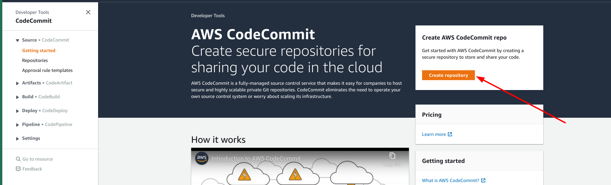

# AWS Code Commit

## Overview

[Code Commit](https://aws.amazon.com/codecommit/) is a source code management service offered by AWS.

Code Commit is a highly available and secure source code management serivce. CodeCommit easily integrates with other services.

Code commit is a regional service (Isolation region wise)

### Permissions

To be able to manage CodeCommit one needs to be assigned one of the following Policies to their IAM user:

1. AWSCodeCommitReadOnly - Gives read only permission to the repositories in the CodeCommit
2. AWSCodeCommitPowerUser - Gives fumages/aws_codecommit_1.pngll access to the repositories but doesn't allow to delete any repository
3.  AWSCodeCommitFullAccess - Provides full access to AWS CodeCommit via the AWS Management Console.

### Create a repository 

1. To Create CodeCommit repository from console 
	1. Login to the aws console
	2. Search for CodeCommit in the search bar
	3. Open CodeCommit and Click on `Create repository`

