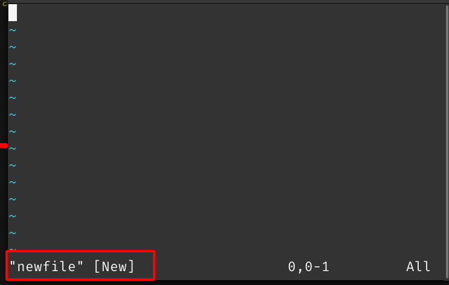
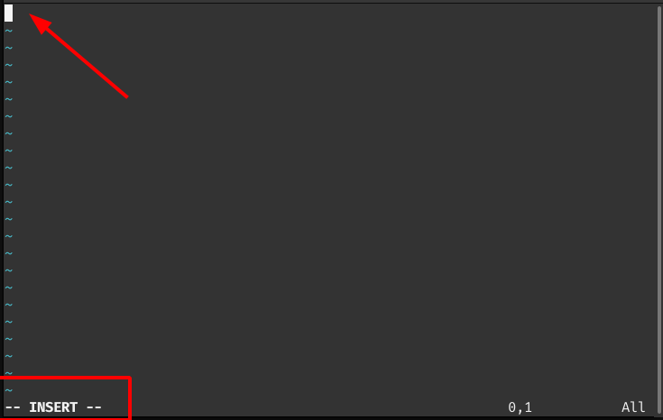
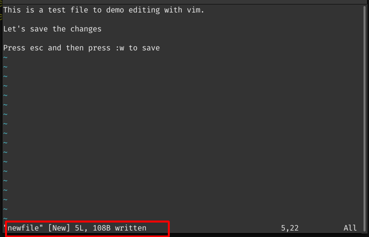

# Vi/Vim


vi/vim is a text editor available in most of the linux distributions. It is one of the most extensible and customizable editors with advanced features.


To create a file wtih vim run 

```bash
vim newfile
```


The terminal looks like below




Note: If `newfile` already exists and is a text file it opens the existing file for editing.

vi has three modes

1. Command Mode - The default mode when you open vi/vim.
2. Insert Mode  - This mode is to edit text Press `i` to enter insert mode.
3. Visual Mode  - This mode will help you in selecting text. Press `v` to enteo r Visual mode


The default mode is `Command Mode` in which vim accepts commands. 

To start typing enter `Insert Mode` by pressing the letter `i`. The terminal looks like below now



To enter command mode, press `esc` key on your keyboard.

To save the file press `esc` to enter `Command Mode` and type `:w`

The terminal looks like below:



When in `Command Mode` you cannot edit and in `Insert mode` you cannot execute a command.

To save and quit (exit)  make sure you are in `Command Mode` and type `:wq` 

To quit without saving in `Command Mode` type `:q!` 


## Basic Commands

|Command     |  Action                              |
|------------|:-------------------------------------|
|i           | insert mode                          |
|v           | Visual mode                          |
|shift+v     | Visual Line                          |
|:w      	 | Write changes / save the file        |
|:q          | Quit the vi editor                   |
|:wq         | Save and edit                        | 
|:q!         |exit without saving                   |    

## Navigation

|Command     |  Action                              |
|------------|:-------------------------------------|
|u       	 |undo                                  |
|ctrl+r      |redo                                  |
|gg          |Go to the start of the file           |
|shift+g     |Go to the end of the file             |
|:*n*        |Go to the the *n*th line                |
|:set number |Shows line numbers at the start of the line | 

  	 


## Editing Commands

|Command     |  Action                              |
|------------|:-------------------------------------|
|p       	 |Paste                                 |
|dd      	 |Deletes a line                        |
|*n*dd       | Deletes *n* no. of lines             |
| y       	 |yank / copy                           |
|*n*yy         | yanks *n* no. of lines               |   
|:s/abc/xyz/g | replaces `abc` with `xyz` on the current line |
|:%s/abc/xyz/g | replaces `abc` with `xyz`in the entire file |


